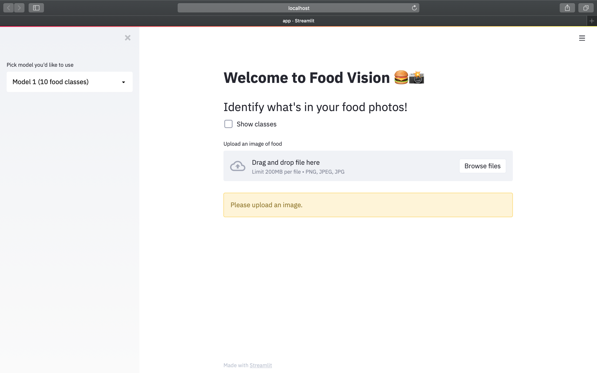
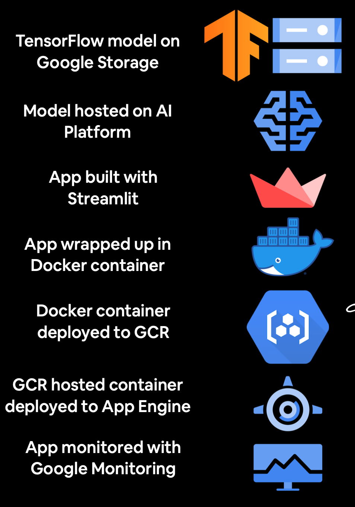

# Food-Vision-App
This is  a Streamlit-powered web application named Food Vision 🍔👁 for classifying images of food using Deep Learning model in TensorFlow and deployed on Google Cloud Paltform(GCP).
The first view of the app is look like:

## Project Workflow

## Food Image Classification:

* Produced a model using EfficientNet Neural Network to detect the food type from the image of food uploaded. The link to the Jupyternotrbook is()
* Developed a model for the prediction using Streamlite(  http://192.168.0.66:8501).
* Deployed the model using Google Cloud Platform. 

## Tools Used

* Jupyter Notebook
* Streamlit
* Google App Engine
* Docker System

